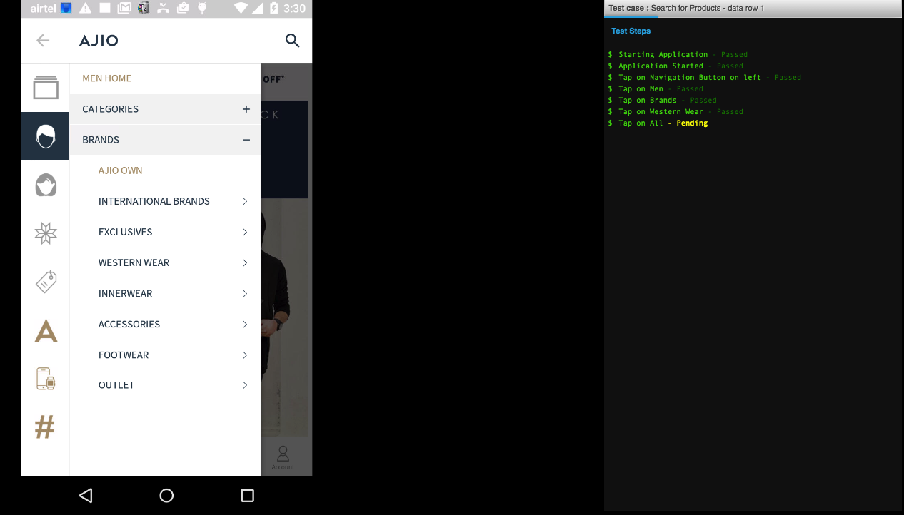

Live View
=========

On the header in the RobusTest application you will find a link for Live View.
This page displays a list of all the open sessions belonging to the user logged in. This page will show all active manual, recording and automation run sessions. Even test runs made using RobusTest Hub can be accessed here.

 .. image:: _static/liveview.png

User can end an active manual test or test recording session from this page by clicking on the eject button.

To view the live screen of a device currently being used by the user, just click on the monitor icon. A new window will open with the screen of the device. In case of a test run, one can also see the test steps on the live screen.

